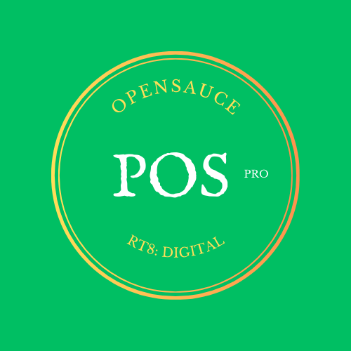
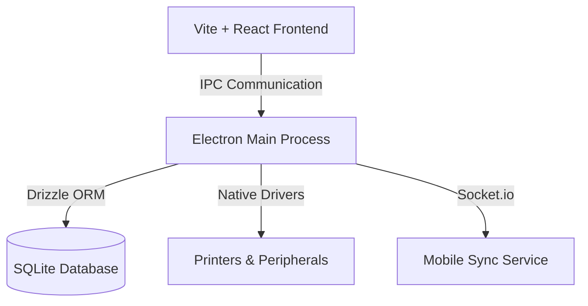

<div align="center">
  
  <h1>🍣 OpenSauce POS</h1>
  <p><strong>A Premium, Agentic-Built Point of Sale System for the Modern Enterprise</strong></p>

  [](https://github.com/rt8digital/opensauce-pos)
  [](LICENSE)
  [](https://www.electronjs.org/)
  [](https://reactjs.org/)
  [](https://tailwindcss.com/)
  <br />
  <a href="https://github.com/rt8digital/opensauce-pos/stargazers"><strong>⭐️ Star this project on GitHub</strong></a>
</div>

---

## 🌟 Overview

**OpenSauce POS** is not just another checkout tool; it's a high-performance, aesthetically driven retail orchestration platform. Engineered with a focus on **visual excellence** and **operational speed**, it bridges the gap between complex enterprise ERPs and simple mobile payment apps.

Designed specifically for Windows/Desktop environments, it leverages **Electron** for native performance and **SQLite** for zero-latency local data persistence, ensuring your business stays online even when the internet doesn't.

---

## 📸 Visual Gallery

<details>
<summary><b>🖼️ Click to Expand Screenshots</b></summary>

### 🛰️ The Command Center

*Modern PIN-based authentication for secure role access.*

### 🛒 Point of Sale
<div align="center">
  
  
</div>
*Lightning-fast item search, barcode scanning, and dynamic cart management.*

### 📦 Inventory & Customers
<div align="center">
  
  
</div>
*Deep inventory control with low-stock alerts and integrated CRM.*

### 🛠️ Robust Peripherals & Customization
<div align="center">
  
  
  
</div>
*Native support for ESC/POS thermal printers, USB scales, and custom branding.*

</details>

---

## 🚀 Key Features

- **⚡ Instant Sync**: Zero-latency local database updates with background cloud synchronization capabilities.
- **🎨 Elite UI/UX**: Professional "Zinc & Neon Green" aesthetic with full Dark Mode support.
- **🔌 Peripheral Hub**: Plug-and-play support for:
  - ESC/POS Thermal Printers (USB, Network, Bluetooth)
  - Barcode Scanners (Serial/HID)
  - Physical Cash Drawers & Customer Displays
- **📊 Business Intelligence**: Advanced reporting with date-range filters, profit margin analysis, and CSV/PDF exports.
- **🔐 Enterprise Security**: Role-based access control (RBAC) with secure PIN encryption and audit logging.
- **📱 Hybrid Reach**: Native desktop power with optional mobile companion linking via QR code.

---

## 🏗️ Architecture



- **Frontend**: React 18, TanStack Query v5, Framer Motion (Animations)
- **Engine**: Electron 39 (Optimized for Windows)
- **ORM**: Drizzle ORM for type-safe database migrations
- **Storage**: Better-SQLite3 for high-speed local data handling

---

## 🛠️ Installation & Setup

### 1. Prerequisites
- **Node.js**: v18.x or v20.x (Recommended)
- **NPM**: v9+
- **Build Tools**: Windows Build Tools (for `better-sqlite3` native compilation)

### 2. Clone & Install
```bash
git clone https://github.com/rt8digital/opensauce-pos.git
cd opensauce-pos
npm install
```

### 3. Environment Configuration
Create a `.env` file in the root:
```env
DATABASE_URL=sqlite.db
NODE_ENV=development
USE_MEMORY_STORAGE=false
```

### 4. Launch Development
```bash
# Start Vite + Electron in optimized dev mode
npm run dev:electron
```

### 5. Packaging (Production)
```bash
# Build the application for Windows
npm run build:electron:installer
```

---

## 📝 Usage as a Template

This repository is designed to be highly modular. To use it as a foundation for your own POS project:
1. **Branding**: Replace `assets/logo.png` and `client/src/index.css` CSS variables.
2. **Schema**: Modify `shared/schema.ts` to add custom product fields or order metadata.
3. **Receipts**: Customize `client/src/lib/receipt-formatter.ts` for your specific regional requirements.

---

## 🗺️ Roadmap
- [ ] **v1.7**: VAS Services integration (Airtime/Electricity)
- [ ] **v1.8**: Hybrid Crypto-Payment processing
- [ ] **v2.0**: Full Cloud Sync & Multi-Store Dashboard

---

## 🤝 Contributing

Contributions are what make the open source community such an amazing place to learn, inspire, and create. Any contributions you make are **greatly appreciated**.

1. Fork the Project
2. Create your Feature Branch (`git checkout -b feature/AmazingFeature`)
3. Commit your Changes (`git commit -m 'Add some AmazingFeature'`)
4. Push to the Branch (`git push origin feature/AmazingFeature`)
5. Open a Pull Request

---

## 📄 License

Distributed under the MIT License. See `package.json` for more information.

---

<p align="center">
  Developed by the <strong>OpenSauce Team</strong> with ❤️
  <br />
  <em>"Turning Sales into Science."</em>
</p>
