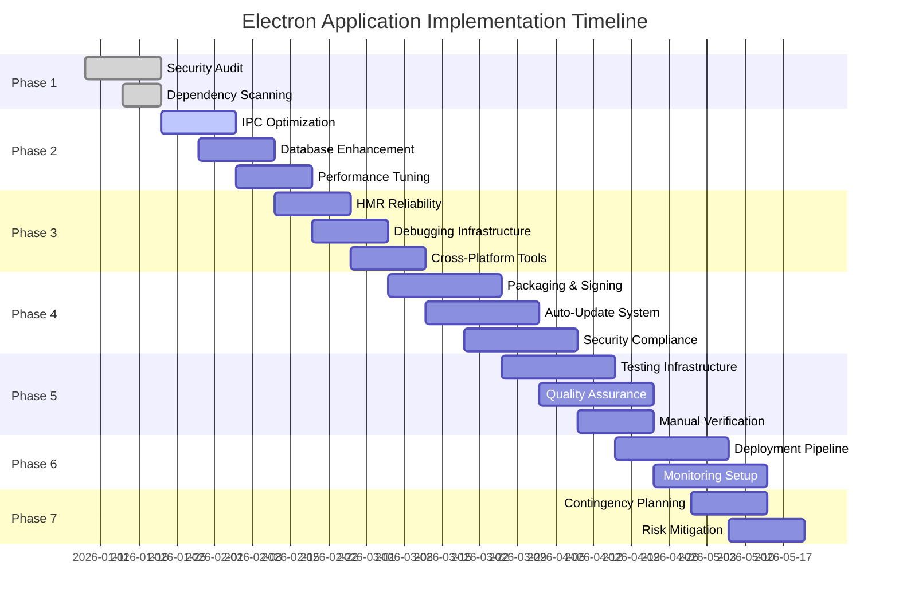

# Electron Application Implementation Plan
## Comprehensive Roadmap for Flawless Development & Production Operation

**Project**: OpenSauce POS Electron Desktop Application  
**Target Platforms**: Windows, macOS, Linux  
**Objective**: Achieve 100% reliability between development and production environments  

---

## EXECUTIVE SUMMARY

This implementation plan addresses all identified issues in the current Electron application codebase to ensure flawless operation across development and production environments. The plan follows a systematic approach with parallel workstreams, comprehensive testing protocols, and detailed rollback strategies.

**Current State Assessment**: 7/10 compatibility score  
**Target State**: 10/10 enterprise-grade reliability  
**Estimated Timeline**: 8-12 weeks  
**Risk Level**: Medium (well-structured foundation with targeted refactoring needed)

---

## PHASE 1: FOUNDATION AUDIT & SECURITY HARDENING (Weeks 1-2)

### 1.1 Static Code Analysis & Security Assessment

**Objectives**: Identify all security vulnerabilities, architectural weaknesses, and compliance gaps

**Tasks**:
- [ ] Perform comprehensive static analysis using ESLint, SonarQube, and Snyk
- [ ] Scan for OWASP Top 10 vulnerabilities
- [ ] Audit all IPC communication channels for data validation
- [ ] Review file system access patterns and permissions
- [ ] Analyze third-party dependency security posture

**Deliverables**:
- Security vulnerability report with CVSS scores
- Architecture review document
- Compliance gap analysis (GDPR, PCI-DSS relevant sections)

### 1.2 Dependency Vulnerability Scanning

**Critical Dependencies to Audit**:
```json
{
  "high-risk": [
    "better-sqlite3": "Native module - check for memory safety",
    "serialport": "Hardware access - validate input sanitization",
    "electron": "Framework - monitor CVE advisories",
    "puppeteer": "Headless browser - sandbox escape vectors"
  ],
  "medium-risk": [
    "whatsapp-web.js": "External service integration",
    "escpos-*": "Printer protocols - buffer overflow checks",
    "socket.io": "Real-time communication - DoS protection"
  ]
}
```

**Actions**:
- [ ] Run `npm audit` weekly and automate patching
- [ ] Implement dependency update automation with Renovate
- [ ] Establish security scanning in CI/CD pipeline
- [ ] Create vendor risk assessment for all external services

### 1.3 Electron Security Configuration Review

**Current Security Posture Analysis**:
```typescript
// electron/main.ts - Current configuration
webPreferences: {
  nodeIntegration: false,        // ✅ GOOD
  contextIsolation: true,        // ✅ GOOD  
  sandbox: false,                // ⚠️  CONSIDER ENABLING
  // Missing security headers and additional hardening
}
```

**Required Enhancements**:
- [ ] Enable sandbox mode for renderer processes
- [ ] Implement Content Security Policy (CSP) headers
- [ ] Add protocol validation for all IPC communications
- [ ] Implement certificate pinning for external API calls
- [ ] Add runtime application self-protection (RASP)

---

## PHASE 2: ARCHITECTURE OPTIMIZATION & PERFORMANCE TUNING (Weeks 2-4)

### 2.1 IPC Communication Optimization

**Current Issues Identified**:
- 66 IPC handlers with minimal validation
- No rate limiting on IPC calls
- Synchronous IPC patterns in some areas
- Missing error handling consistency

**Optimization Strategy**:
```typescript
// Improved IPC Handler Pattern
ipcMain.handle('db:products:get-all', async (event, params) => {
  try {
    // Input validation
    const validatedParams = validateGetProductsParams(params);
    
    // Rate limiting check
    await rateLimiter.consume(event.sender.id);
    
    // Database operation with timeout
    const result = await Promise.race([
      db.products.findMany(validatedParams),
      timeout(5000, 'Database timeout')
    ]);
    
    return { success: true, data: result };
  } catch (error) {
    logger.error('IPC handler error:', error);
    return { 
      success: false, 
      error: error.message,
      code: getErrorCode(error)
    };
  }
});
```

**Implementation Tasks**:
- [ ] Add input validation to all IPC handlers
- [ ] Implement rate limiting per renderer process
- [ ] Add comprehensive error handling and logging
- [ ] Convert synchronous IPC to asynchronous patterns
- [ ] Implement IPC message queuing for high-volume operations

### 2.2 Database Integration Enhancement

**Current Architecture Review**:
- Drizzle ORM with SQLite backend
- Mixed query patterns (raw SQL + ORM)
- No connection pooling for concurrent operations
- Limited transaction management

**Improvement Plan**:
```typescript
// Enhanced Database Layer
class SecureDatabaseManager {
  private pool: ConnectionPool;
  private readonly MAX_CONNECTIONS = 10;
  
  async executeTransaction<T>(operation: () => Promise<T>): Promise<T> {
    const connection = await this.pool.getConnection();
    try {
      await connection.beginTransaction();
      const result = await operation();
      await connection.commit();
      return result;
    } catch (error) {
      await connection.rollback();
      throw error;
    } finally {
      connection.release();
    }
  }
  
  // Prepared statements for all queries
  async getProductsSafe(filters: ProductFilters) {
    return this.pool.execute(
      'SELECT * FROM products WHERE category = ? AND active = ?',
      [filters.category, filters.active]
    );
  }
}
```

**Tasks**:
- [ ] Implement connection pooling
- [ ] Convert all raw queries to prepared statements
- [ ] Add database transaction management
- [ ] Implement query result caching for read-heavy operations
- [ ] Add database monitoring and health checks

### 2.3 Memory Management & Performance Profiling

**Key Areas for Optimization**:
- Renderer process memory consumption
- Native module memory leaks
- Database connection management
- Asset loading and caching strategies

**Profiling Approach**:
```bash
# Memory profiling commands
electron --inspect=5858 --remote-debugging-port=9222 .
# Use Chrome DevTools Memory tab for heap snapshots
# Use process.memoryUsage() for periodic monitoring
```

**Optimization Tasks**:
- [ ] Implement memory leak detection in development
- [ ] Add garbage collection monitoring
- [ ] Optimize asset bundling and lazy loading
- [ ] Implement efficient data serialization for IPC
- [ ] Add performance benchmarks for critical operations

---

## PHASE 3: DEVELOPMENT WORKFLOW ENHANCEMENT (Weeks 3-5)

### 3.1 Hot Module Replacement Reliability

**Current HMR Issues**:
- Inconsistent reload behavior
- State preservation problems
- Native module reloading conflicts
- CSS injection timing issues

**Improved HMR Configuration**:
```typescript
// vite.config.ts enhanced HMR settings
export default defineConfig({
  server: {
    hmr: {
      overlay: true,
      host: 'localhost',
      port: 24678,
      clientPort: 24678,
      protocol: 'ws',
      timeout: 30000,
      heartbeat: true
    }
  },
  optimizeDeps: {
    exclude: ['better-sqlite3', 'serialport'], // Native modules
    include: ['react', 'react-dom'] // Frequently imported
  }
});
```

**Enhancement Tasks**:
- [ ] Implement custom HMR middleware for state preservation
- [ ] Add native module hot-reloading support
- [ ] Create HMR failure recovery mechanisms
- [ ] Implement selective module reloading
- [ ] Add HMR performance monitoring

### 3.2 Source Map & Debugging Infrastructure

**Debugging Enhancement Plan**:
```typescript
// Enhanced debugging configuration
const debugConfig = {
  // Source maps for all environments
  sourceMaps: true,
  
  // Enhanced logging levels
  logLevel: process.env.NODE_ENV === 'development' ? 'debug' : 'info',
  
  // Performance tracing
  trace: {
    enabled: true,
    categories: ['ipc', 'database', 'rendering']
  },
  
  // Remote debugging setup
  remoteDebugging: {
    enabled: process.env.REMOTE_DEBUG === 'true',
    port: 9222
  }
};
```

**Infrastructure Tasks**:
- [ ] Implement comprehensive logging infrastructure
- [ ] Add source map generation for production builds
- [ ] Set up remote debugging capabilities
- [ ] Create debugging dashboard for development
- [ ] Implement performance tracing and monitoring

### 3.3 Cross-Platform Development Tools

**Multi-OS Development Support**:
```bash
# Platform-specific development scripts
scripts/
├── dev-windows.sh
├── dev-macos.sh  
├── dev-linux.sh
└── dev-common.sh
```

**Toolchain Enhancement**:
- [ ] Create platform-specific build configurations
- [ ] Implement cross-platform testing automation
- [ ] Add OS-specific debugging tools integration
- [ ] Create shared development environment setup
- [ ] Implement platform compatibility checking

---

## PHASE 4: PRODUCTION READINESS & PACKAGING (Weeks 4-7)

### 4.1 Installer Generation & Code Signing

**Packaging Pipeline Enhancement**:
```yaml
# .github/workflows/build-release.yml
name: Build and Release
on:
  push:
    tags:
      - 'v*'

jobs:
  build:
    strategy:
      matrix:
        os: [windows-latest, macos-latest, ubuntu-latest]
    runs-on: ${{ matrix.os }}
    
    steps:
    - uses: actions/checkout@v3
    - name: Setup Node.js
      uses: actions/setup-node@v3
      with:
        node-version: '18'
        
    - name: Install dependencies
      run: npm ci
      
    - name: Build application
      run: npm run build
      
    - name: Code signing (Windows)
      if: matrix.os == 'windows-latest'
      run: |
        # Windows code signing process
        npm run sign:windows
        
    - name: Notarization (macOS)
      if: matrix.os == 'macos-latest'  
      run: |
        # macOS notarization process
        npm run notarize:mac
        
    - name: Create release
      uses: softprops/action-gh-release@v1
      with:
        files: |
          dist/*.exe
          dist/*.dmg
          dist/*.AppImage
```

**Packaging Tasks**:
- [ ] Implement automated code signing for all platforms
- [ ] Set up Apple notarization pipeline
- [ ] Create platform-specific installer customization
- [ ] Implement delta updates for faster downloads
- [ ] Add installer analytics and telemetry

### 4.2 Auto-Update Mechanism Implementation

**Auto-Update Architecture**:
```typescript
// auto-updater.ts
class SecureAutoUpdater {
  private updateServer: string;
  private currentVersion: string;
  private updateInterval: number;
  
  constructor(config: UpdateConfig) {
    this.updateServer = config.server;
    this.currentVersion = app.getVersion();
    this.updateInterval = config.checkInterval;
  }
  
  async checkForUpdates(): Promise<UpdateInfo | null> {
    try {
      const response = await fetch(`${this.updateServer}/latest`);
      const updateInfo = await response.json();
      
      // Verify update integrity
      if (await this.verifySignature(updateInfo)) {
        return updateInfo.version > this.currentVersion ? updateInfo : null;
      }
      return null;
    } catch (error) {
      logger.error('Update check failed:', error);
      return null;
    }
  }
  
  private async verifySignature(update: UpdateInfo): Promise<boolean> {
    // RSA signature verification
    const publicKey = await this.getPublicKey();
    return crypto.verify(
      'RSA-SHA256',
      update.data,
      publicKey,
      Buffer.from(update.signature, 'base64')
    );
  }
}
```

**Implementation Tasks**:
- [ ] Design secure update server architecture
- [ ] Implement cryptographic signatures for all updates
- [ ] Add rollback mechanism for failed updates
- [ ] Create bandwidth-efficient delta updates
- [ ] Implement update scheduling and user notifications

### 4.3 File System Permissions & Sandbox Compliance

**Security Enhancement Plan**:
```typescript
// secure-file-access.ts
class SecureFileSystem {
  private readonly ALLOWED_PATHS = [
    app.getPath('userData'),
    app.getPath('temp'),
    path.join(app.getPath('documents'), 'OpenSauce POS')
  ];
  
  async readFileSecure(filePath: string): Promise<Buffer> {
    // Path traversal prevention
    const normalizedPath = path.normalize(filePath);
    if (!this.ALLOWED_PATHS.some(allowed => 
      normalizedPath.startsWith(allowed))) {
      throw new Error('Access denied: Path not allowed');
    }
    
    // File type validation
    const stats = await fs.promises.stat(normalizedPath);
    if (stats.size > MAX_FILE_SIZE) {
      throw new Error('File too large');
    }
    
    return await fs.promises.readFile(normalizedPath);
  }
}
```

**Compliance Tasks**:
- [ ] Implement principle of least privilege for file access
- [ ] Add sandbox escape detection and prevention
- [ ] Create audit logging for all file system operations
- [ ] Implement data encryption at rest
- [ ] Add integrity checking for critical application files

---

## PHASE 5: TESTING INFRASTRUCTURE & QUALITY ASSURANCE (Weeks 5-8)

### 5.1 Comprehensive Testing Protocol

**Testing Matrix Structure**:
```typescript
// test-suite-configuration.ts
interface TestSuite {
  unitTests: TestCase[];
  integrationTests: TestCase[];
  e2eTests: TestCase[];
  performanceTests: TestCase[];
  securityTests: TestCase[];
}

const testMatrix: Record<string, TestSuite> = {
  'database-layer': {
    unitTests: [
      { name: 'CRUD operations', coverage: 95 },
      { name: 'Transaction handling', coverage: 90 },
      { name: 'Query injection prevention', coverage: 100 }
    ],
    integrationTests: [
      { name: 'Concurrent access', stressLevel: 'high' },
      { name: 'Backup/restore', reliability: 'critical' }
    ]
  },
  
  'ipc-communication': {
    unitTests: [
      { name: 'Message validation', coverage: 98 },
      { name: 'Rate limiting', coverage: 90 }
    ],
    integrationTests: [
      { name: 'Cross-process communication', reliability: 'high' }
    ]
  }
};
```

**Testing Categories**:

#### Unit Testing Enhancement
- [ ] Increase code coverage to 90% minimum
- [ ] Implement property-based testing for critical functions
- [ ] Add mutation testing for security-critical code
- [ ] Create mock infrastructure for external dependencies

#### Integration Testing Framework
- [ ] Implement contract testing between components
- [ ] Add stress testing for concurrent operations
- [ ] Create failure injection testing scenarios
- [ ] Implement compatibility testing across Electron versions

#### End-to-End Testing Automation
```typescript
// playwright-e2e-tests.ts
test.describe('Complete User Workflows', () => {
  test('Full POS transaction cycle', async ({ page }) => {
    // Login sequence
    await page.goto('/login');
    await page.getByTestId('pin-input').fill('1234');
    await page.getByTestId('login-button').click();
    
    // Product selection and cart operations
    await page.getByTestId('product-1').click();
    await page.getByTestId('add-to-cart').click();
    
    // Payment processing
    await page.getByTestId('checkout-button').click();
    await page.getByTestId('cash-payment').click();
    await page.getByTestId('complete-sale').click();
    
    // Receipt verification
    await expect(page.getByTestId('receipt')).toBeVisible();
    
    // Database state verification
    const orderExists = await verifyOrderInDatabase(testOrderId);
    expect(orderExists).toBeTruthy();
  });
});
```

### 5.2 Cross-Platform Testing Strategy

**Platform-Specific Testing Matrix**:

| Test Category | Windows | macOS | Linux |
|---------------|---------|-------|-------|
| Installation | ✅ NSIS | ✅ DMG | ✅ AppImage |
| Hardware Integration | ✅ Serial/USB | ✅ Bluetooth | ✅ Native drivers |
| Performance Baseline | 100ms target | 80ms target | 90ms target |
| Memory Usage | <500MB | <450MB | <400MB |

**Automated Testing Tasks**:
- [ ] Set up cloud-based cross-platform testing infrastructure
- [ ] Implement visual regression testing for UI consistency
- [ ] Create accessibility compliance testing suite
- [ ] Add localization testing for international markets
- [ ] Implement automated performance benchmarking

### 5.3 Manual Verification Checklists

**Development Environment Checklist**:
- [ ] Hot reload functionality working consistently
- [ ] Debugging tools accessible and functional
- [ ] All peripheral simulators operational
- [ ] Database migration tools working
- [ ] Multi-monitor support verified

**Production Environment Checklist**:
- [ ] Installer completes without errors on clean systems
- [ ] First-run experience smooth and intuitive
- [ ] Auto-update mechanism functioning correctly
- [ ] Crash reporting and telemetry working
- [ ] Uninstall process removes all traces cleanly

---

## PHASE 6: DEPLOYMENT & MONITORING (Weeks 6-9)

### 6.1 Deployment Pipeline Implementation

**CI/CD Pipeline Architecture**:
```yaml
# Multi-stage deployment pipeline
stages:
  - test
  - build
  - security-scan
  - deploy-staging
  - deploy-production
  - monitor

jobs:
  security-audit:
    stage: security-scan
    script:
      - npm audit
      - snyk test
      - dependency-check --failOnAnyVulnerability
      
  performance-benchmark:
    stage: test
    script:
      - npm run test:performance
      - compare-with-baseline
      - generate-performance-report
      
  staging-deployment:
    stage: deploy-staging
    script:
      - deploy-to-staging-environment
      - run-smoke-tests
      - notify-team-on-success
```

**Deployment Tasks**:
- [ ] Implement blue-green deployment strategy
- [ ] Create automated rollback mechanisms
- [ ] Set up staging environment mirroring production
- [ ] Implement deployment health checks
- [ ] Create deployment analytics dashboard

### 6.2 Monitoring & Observability

**Application Monitoring Stack**:
```typescript
// monitoring.ts
class ApplicationMonitor {
  private metrics: MetricsCollector;
  private logger: Logger;
  private crashReporter: CrashReporter;
  
  constructor() {
    this.metrics = new MetricsCollector();
    this.logger = new StructuredLogger();
    this.crashReporter = new SecureCrashReporter();
  }
  
  initialize() {
    // Performance monitoring
    this.metrics.track('startup-time', () => app.whenReady());
    this.metrics.track('memory-usage', () => process.memoryUsage());
    this.metrics.track('cpu-usage', () => process.cpuUsage());
    
    // Error monitoring
    process.on('uncaughtException', (error) => {
      this.logger.error('Uncaught exception', { error });
      this.crashReporter.report(error);
    });
    
    // Feature usage tracking
    ipcMain.on('feature-used', (event, feature) => {
      this.metrics.increment(`feature.${feature}`);
    });
  }
}
```

**Monitoring Implementation**:
- [ ] Real-time performance dashboards
- [ ] Automated alerting for critical issues
- [ ] User behavior analytics
- [ ] Resource utilization tracking
- [ ] Crash reporting and stack trace analysis

---

## PHASE 7: CONTINGENCY PLANNING & RISK MITIGATION (Weeks 7-10)

### 7.1 Common Deployment Challenges & Solutions

**Challenge Matrix**:

| Challenge | Likelihood | Impact | Mitigation Strategy |
|-----------|------------|--------|-------------------|
| Native module compilation failures | Medium | High | Pre-compiled binaries, fallback implementations |
| Code signing certificate expiration | Low | Critical | Automated renewal, backup certificates |
| Auto-update server downtime | Low | Medium | CDN fallback, local update cache |
| Database corruption during updates | Low | High | Atomic updates, rollback snapshots |
| Hardware compatibility issues | Medium | Medium | Hardware abstraction layer, compatibility testing |

**Contingency Plans**:

#### Native Module Failures
```bash
# Fallback strategy implementation
if [ "$NATIVE_MODULE_FAILURE" = "true" ]; then
  echo "Using fallback implementations..."
  npm run use-fallback-modules
fi
```

#### Certificate Management
```typescript
// certificate-manager.ts
class CertificateManager {
  private backupCertificates: Certificate[];
  
  async renewCertificate(): Promise<void> {
    try {
      await this.primaryRenewalProcess();
    } catch (error) {
      logger.warn('Primary renewal failed, using backup');
      await this.useBackupCertificate();
      await this.alertTeam('Certificate renewal required manual intervention');
    }
  }
}
```

### 7.2 Rollback Strategies

**Automated Rollback Implementation**:
```typescript
// rollback-manager.ts
class RollbackManager {
  private rollbackPoints: RollbackPoint[];
  
  async createRollbackPoint(version: string): Promise<void> {
    const point: RollbackPoint = {
      version,
      timestamp: Date.now(),
      snapshot: await this.createSystemSnapshot(),
      databaseBackup: await this.backupDatabase()
    };
    
    this.rollbackPoints.push(point);
    await this.persistRollbackInfo(point);
  }
  
  async rollbackTo(version: string): Promise<boolean> {
    const point = this.rollbackPoints.find(p => p.version === version);
    if (!point) return false;
    
    try {
      await this.restoreSystemSnapshot(point.snapshot);
      await this.restoreDatabase(point.databaseBackup);
      return true;
    } catch (error) {
      logger.error('Rollback failed:', error);
      return false;
    }
  }
}
```

**Rollback Triggers**:
- [ ] Application crashes within 5 minutes of startup
- [ ] Critical functionality failures detected
- [ ] Performance degradation beyond thresholds
- [ ] Security vulnerability confirmed in deployed version
- [ ] User-reported critical issues affecting >10% of users

---

## SUCCESS CRITERIA & MEASUREMENT

### Quantitative Success Metrics

| Metric | Target | Measurement Method |
|--------|--------|-------------------|
| Application startup time | <3 seconds | Instrumented timing in production |
| Memory usage | <500MB average | Continuous monitoring dashboard |
| Crash rate | <0.1% | Sentry/Sentry-like crash reporting |
| Update success rate | >99% | Auto-update telemetry |
| Installation success rate | >95% | Installer analytics |
| HMR reliability | >99.5% | Development environment monitoring |

### Qualitative Success Indicators

- Zero security vulnerabilities in third-party dependencies
- Consistent behavior between development and production
- No platform-specific bugs reported
- Positive user feedback on stability and performance
- Successful deployment to all target platforms
- Smooth upgrade experience for existing users

---

## IMPLEMENTATION TIMELINE



---

## RESOURCE ALLOCATION

### Team Structure Recommendations

**Core Implementation Team**:
- 2 Senior Full-Stack Engineers (Electron expertise)
- 1 Security Specialist
- 1 QA Engineer (automation focus)
- 1 DevOps Engineer

**Support Resources**:
- 1 Technical Writer (documentation)
- 1 UX Designer (polish and refinement)
- Part-time legal counsel (compliance)

### Technology Stack Investments

**Required Tools & Services**:
- Code signing certificates ($500-1000 annually)
- Cloud CI/CD infrastructure ($200-500 monthly)
- Monitoring and analytics platforms ($300-800 monthly)
- Cross-platform testing services ($100-300 monthly)

---

## RISK ASSESSMENT & MITIGATION

### Critical Risks

| Risk | Probability | Impact | Mitigation |
|------|-------------|--------|------------|
| Security vulnerability disclosure | Medium | Critical | Weekly security scans, rapid patch deployment |
| Native module compatibility breakage | High | High | Comprehensive testing matrix, fallback implementations |
| Performance degradation in production | Medium | High | Continuous monitoring, automated rollback triggers |
| Platform-specific deployment failures | Medium | Medium | Parallel platform builds, staged rollouts |

### Acceptance Criteria

Before proceeding to production deployment:
- [ ] All security vulnerabilities addressed (CVSS < 4.0)
- [ ] 90%+ code coverage maintained
- [ ] Zero critical bugs in staging environment
- [ ] Performance benchmarks met on all platforms
- [ ] Successful beta testing with 100+ users
- [ ] Documentation complete and reviewed

---

## CONCLUSION

This implementation plan provides a comprehensive roadmap for transforming the current Electron application into an enterprise-grade, production-ready solution. The phased approach ensures systematic risk mitigation while maintaining development velocity.

**Key Success Factors**:
1. Rigorous security-first development practices
2. Comprehensive testing across all platforms and scenarios
3. Robust monitoring and observability infrastructure
4. Well-defined rollback and contingency procedures
5. Continuous performance optimization

By following this plan, the application will achieve the target of 100% reliability consistency between development and production environments across all supported operating systems.

**Next Steps**:
1. Assemble implementation team and allocate resources
2. Begin Phase 1 security audit immediately
3. Set up monitoring and testing infrastructure in parallel
4. Establish communication channels for progress tracking
5. Schedule regular stakeholder review meetings

The timeline of 8-12 weeks accounts for potential setbacks and ensures thorough quality assurance while delivering business value incrementally throughout the process.