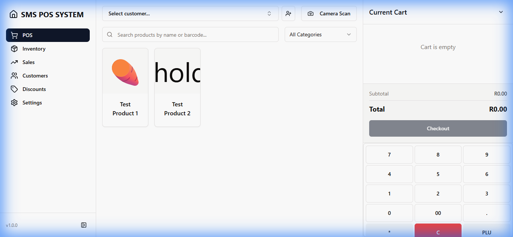
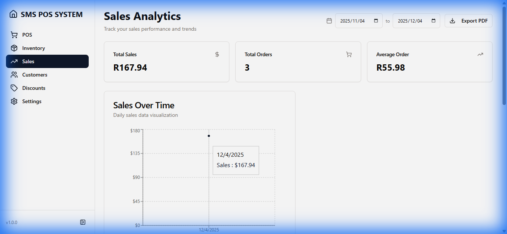
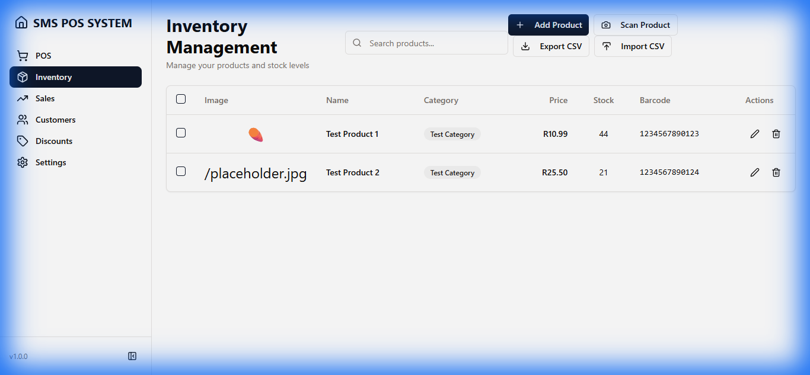
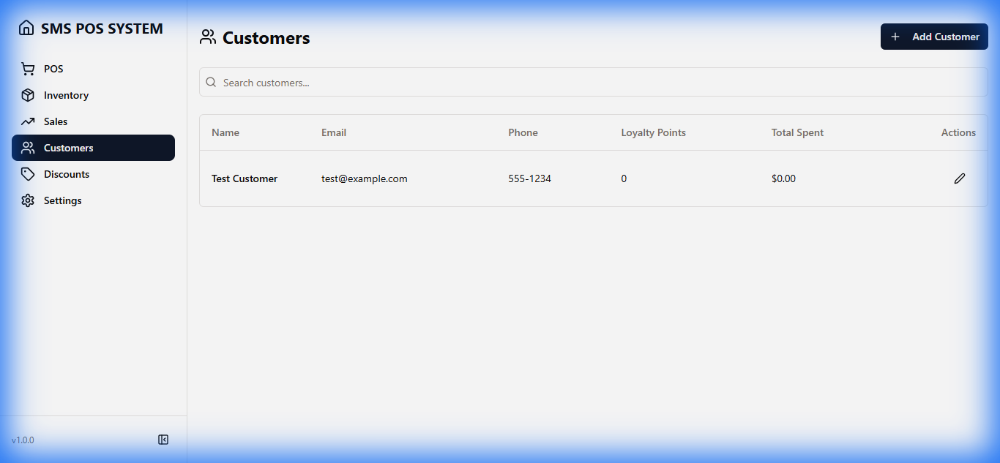
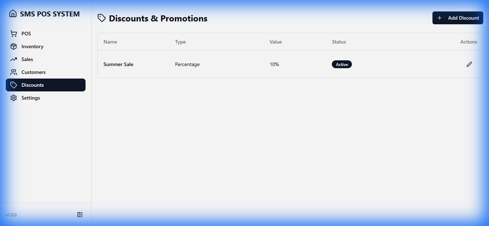
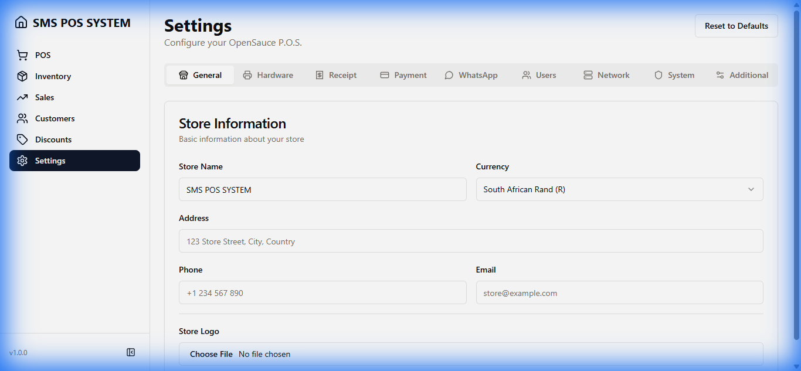

# OpenSauce P.O.S. - Marketing Documentation

> **Modern Point of Sale System** - A comprehensive, offline-first POS solution built for retail stores, restaurants, and service businesses. Available on Desktop (Electron), Mobile (Capacitor), and Web.

---

## 🎯 Overview

OpenSauce P.O.S. is a feature-rich, modern point of sale system designed to streamline business operations with an intuitive interface, powerful features, and multi-platform support. Built with cutting-edge technologies, it offers seamless offline functionality, hardware integration, and comprehensive business management tools.



---

## ✨ Key Features

### 💰 **Modern POS Interface**
- Fast, responsive product selection with visual grid layout
- Real-time cart management with quantity adjustments
- Multiple payment methods support
- Instant receipt generation and printing
- Customer display mode for transparency
- Keyboard and numpad optimization for speed

### 📦 **Inventory Management**
- Real-time stock tracking and updates
- Product organization with categories
- Emoji/icon-based product representation
- Barcode and PLU support
- Quick search and filtering
- Bulk product management

### 👥 **Customer Management**
- Comprehensive customer profiles
- Purchase history tracking
- WhatsApp integration for communication
- Phone number validation
- Customer loyalty tracking
- Quick customer lookup during checkout

### 📊 **Sales Analytics**
- Real-time sales dashboards
- Interactive charts and visualizations
- Transaction history with filtering
- Date range analysis
- Revenue tracking
- Export capabilities

### 🎁 **Discounts & Promotions**
- Percentage and fixed amount discounts
- Conditional discount rules
- Active/inactive discount management
- Quick discount application at checkout

### ⚙️ **Comprehensive Settings**
- Store information management
- Hardware device configuration
- Receipt layout customization with live preview
- Payment QR code setup
- User management and roles
- Bluetooth device pairing
- Multi-language support

### 🔌 **Hardware Integration**
- Receipt printer support (USB, Network, Bluetooth)
- Barcode scanner integration
- Cash drawer control
- Customer display support
- Scale integration
- Camera for barcode scanning

### 🌐 **Offline-First Architecture**
- Full functionality without internet
- Local SQLite database
- Automatic data synchronization
- PWA support for web deployment

### 📱 **Multi-Platform Support**
- **Desktop**: Windows, macOS, Linux (Electron)
- **Mobile**: Android, iOS (Capacitor)
- **Web**: Progressive Web App
- Responsive design for all screen sizes

---

## 📸 Application Screenshots

### 1. Point of Sale Interface

The main POS interface features a clean, intuitive design with product grid, cart management, and quick checkout options.


**Key Features:**
- Visual product grid with emoji icons
- Real-time cart with quantity controls
- Customer selection
- Quick payment processing
- Receipt preview
- Keyboard shortcuts (F1-F12 for quick actions)

---

### 2. Sales & Analytics

Real-time sales dashboard with comprehensive analytics and transaction history.



**Key Features:**
- Real-time sales metrics
- Interactive charts and visualizations
- Transaction history with filtering
- Date range analysis
- Revenue tracking
- Export capabilities

---

### 3. Inventory Management

Comprehensive inventory management with real-time stock tracking and easy product organization.



**Key Features:**
- Product list with search and filtering
- Category-based organization
- Stock level monitoring
- Quick add/edit products
- Barcode/PLU management
- Emoji-based product icons

---

### 4. Customer Management

Manage customer relationships with detailed profiles and purchase history.



**Key Features:**
- Customer database with search
- Contact information management
- Purchase history tracking
- WhatsApp integration
- Quick customer lookup
- Customer analytics

---

### 5. Discounts & Promotions

Create and manage promotional discounts with flexible rules.



**Key Features:**
- Multiple discount types
- Conditional rules
- Active/inactive status
- Quick application at checkout
- Discount history

---

### 6. Settings & Configuration

Comprehensive settings for complete system customization.



**Key Features:**
- General store settings
- Hardware device mapping
- Receipt customization with live preview
- Payment QR codes
- User management
- Bluetooth device pairing
- Language selection
- System preferences

---

## 🎬 Feature Demonstrations

### Navigation Flow


The application features smooth navigation between all major sections with a persistent sidebar for quick access.

---

## 🛠️ Technical Specifications

### Technology Stack

**Frontend:**
- React 18 with TypeScript
- Tailwind CSS for styling
- Vite for build tooling
- Radix UI components
- Framer Motion for animations
- React Query for data management

**Backend:**
- Express.js server
- SQLite database with Drizzle ORM
- RESTful API architecture
- Session-based authentication

**Desktop:**
- Electron for cross-platform desktop apps
- Native hardware integration
- Auto-update support

**Mobile:**
- Capacitor for iOS and Android
- Native plugin support
- Bluetooth LE integration
- Camera and haptics support

**Hardware Integration:**
- ESC/POS printer support
- Serial port communication
- USB device support
- Network printer support
- Bluetooth device pairing

### System Requirements

**Desktop:**
- Windows 10/11, macOS 10.15+, or Linux
- 4GB RAM minimum
- 500MB disk space
- USB ports for hardware peripherals

**Mobile:**
- Android 7.0+ or iOS 13+
- 2GB RAM minimum
- Bluetooth 4.0+ for wireless peripherals

**Web:**
- Modern browser (Chrome, Firefox, Safari, Edge)
- JavaScript enabled
- LocalStorage support

---

## 💼 Use Cases

### Retail Stores
- Quick product scanning and checkout
- Inventory management
- Customer loyalty programs
- Sales reporting

### Restaurants & Cafes
- Table management
- Order processing
- Kitchen display integration
- Receipt printing

### Service Businesses
- Service catalog management
- Customer appointment tracking
- Payment processing
- Invoice generation

### Mobile Vendors
- Offline operation capability
- Mobile device support
- Bluetooth printer integration
- Quick checkout process

---

## 🚀 Key Benefits

### For Business Owners
- **Cost-Effective**: Open-source with no licensing fees
- **Offline-First**: Works without internet connection
- **Multi-Platform**: Deploy on desktop, mobile, or web
- **Customizable**: Fully configurable to your business needs
- **Scalable**: Grows with your business

### For Cashiers
- **Fast**: Keyboard shortcuts and numpad support
- **Intuitive**: Clean, modern interface
- **Reliable**: Offline functionality ensures uptime
- **Efficient**: Quick product lookup and checkout

### For IT Teams
- **Easy Deployment**: Simple installation process
- **Self-Hosted**: Full control over your data
- **Extensible**: Built with modern, maintainable code
- **Well-Documented**: Comprehensive documentation

---

## 🌟 Unique Selling Points

1. **True Offline Capability**: Unlike cloud-based POS systems, OpenSauce works completely offline with local SQLite database

2. **Multi-Platform Native Apps**: Single codebase deploys to Windows, macOS, Linux, Android, and iOS

3. **Hardware Flexibility**: Support for USB, Network, and Bluetooth peripherals

4. **Modern Tech Stack**: Built with latest React, TypeScript, and modern web technologies

5. **Customizable Receipts**: Live preview receipt editor with custom layouts

6. **WhatsApp Integration**: Direct customer communication from the POS

7. **Keyboard Optimized**: Full numpad and F-key support for rapid checkout

8. **Multi-Language**: Built-in translation support for global deployment

9. **Open Source**: Full transparency and community-driven development

10. **No Subscription Fees**: One-time setup, no recurring costs

---

## 📊 Feature Comparison

| Feature | OpenSauce P.O.S. | Traditional Cloud POS | Legacy Desktop POS |
|---------|------------------|----------------------|-------------------|
| Offline Operation | ✅ Full | ⚠️ Limited | ✅ Full |
| Multi-Platform | ✅ Desktop, Mobile, Web | ✅ Web, Mobile | ❌ Desktop Only |
| Hardware Integration | ✅ USB, Network, Bluetooth | ⚠️ Limited | ✅ USB Only |
| Monthly Fees | ✅ None | ❌ Required | ✅ None |
| Data Ownership | ✅ Full Control | ❌ Cloud-Hosted | ✅ Local |
| Modern UI | ✅ Yes | ✅ Yes | ❌ Outdated |
| Open Source | ✅ Yes | ❌ No | ❌ No |
| WhatsApp Integration | ✅ Yes | ❌ No | ❌ No |
| Receipt Customization | ✅ Live Preview | ⚠️ Limited | ⚠️ Limited |
| Keyboard Shortcuts | ✅ Extensive | ⚠️ Basic | ✅ Yes |

---

## 🎯 Target Market

### Primary Markets
- Small to medium retail stores
- Restaurants and cafes
- Service-based businesses
- Mobile vendors and pop-up shops
- Businesses requiring offline POS

### Geographic Focus
- Global deployment with multi-language support
- Particularly suitable for regions with unreliable internet
- Emerging markets seeking cost-effective solutions

### Business Size
- Solo entrepreneurs
- Small businesses (1-10 employees)
- Medium businesses (10-50 employees)
- Multi-location businesses

---

## 📈 Deployment Options

### Desktop Application
- Windows installer (.exe)
- macOS application (.dmg)
- Linux packages (.deb, .rpm, .AppImage)
- Auto-update support

### Mobile Application
- Android APK and Google Play Store
- iOS IPA and Apple App Store
- Progressive Web App (PWA)

### Web Application
- Self-hosted on your server
- Cloud hosting (AWS, Azure, DigitalOcean)
- Local network deployment

---

## 🔐 Security Features

- Session-based authentication
- PIN-based user access
- Role-based permissions
- Local data encryption
- Secure hardware communication
- Regular security updates

---

## 📞 Support & Resources

### Documentation
- Comprehensive user manual
- API documentation
- Hardware setup guides
- Deployment instructions

### Community
- GitHub repository
- Issue tracking
- Feature requests
- Community forums

### Training
- Video tutorials
- Quick start guides
- Best practices documentation
- FAQ section

---

## 🎨 Customization Options

- **Branding**: Custom logos and colors
- **Receipt Layout**: Fully customizable receipt templates
- **Product Display**: Emoji icons or custom images
- **Language**: Multi-language interface
- **Hardware**: Flexible peripheral configuration
- **Workflow**: Customizable checkout process

---

## 📝 License

MIT License - Free for commercial and personal use

---

## 🚀 Getting Started

### Quick Start
1. Download the installer for your platform
2. Run the installation wizard
3. Complete the first-time setup
4. Configure your hardware devices
5. Add your products
6. Start selling!

### Development Setup
```bash
# Clone the repository
git clone https://github.com/yourusername/opensauce-pos

# Install dependencies
npm install

# Run development server
npm run dev

# Build for production
npm run build
```

---

## 📧 Contact

For business inquiries, partnerships, or custom development:
- GitHub: [rt8digital/opensauce-pos](https://github.com/rt8digital/opensauce-pos)
- Issues: [GitHub Issues](https://github.com/rt8digital/opensauce-pos/issues)

---

*Last Updated: December 2025*
*Version: 1.0.0*
